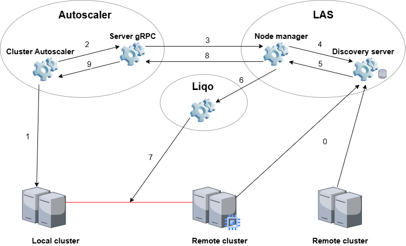

# Kubernetes Cluster Autoscaler for Liqo

The Kubernetes [Cluster Autoscaler project](https://github.com/kubernetes/autoscaler/tree/master/cluster-autoscaler) implements a scaling mechanism that adapts the **size** of the cluster to the current computing demand.
For instance, when the current cluster does not have enough resources to schedule a new pod, it adds a new node to the cluster (_scale out_), and viceversa for _scale in_ operations (the cluster has an excess of resources so that an existing node can be released).
This allows a better control on cost, particularly on public cloud providers.

This repository contains the required components to allow this mechanism to work with Liqo.
In a nutshell, when a cluster detects a scarsity of resources, it can acquire some more resources from another (remote) cluster, using Liqo, which adds a new (virtual) node to the origin cluster.

Given the current behavior of the Cluster Autoscaler (CA) mechanism, the main steps are the following (for the _scale out_ operation):
- The CA detects a lack of resources in the origin cluster (1)
- It asks the provider Liqo (through the gRPC server in this repository) to add a new node to the cluster (2-3)
- Node manager obtain infos about remote cluster that are willing to share resources (4-5)
- Node manager chooses the remote cluster that satisfies the autoscaler request (6) 
- Liqo establishes a new peering with a remote cluster (7)
- Node manager sends the result back to the autoscaler (8-9)
- Once the peering is established, the origin cluster will have a new (virtual) node that summarizes all the resources that are available on the remote cluster
- The origin cluster can now use all the resources of the initial nodes, plus the ones made available on the remote cluster through Liqo

Currently, due to the PoC nature of this project, the _peering establishment_ and the amount of _resources acquired_ are statically defined.
Future extensions will allow this project to decide _which_ cluster ask resources to (e.g., based on economic cost), and _how many_ resources have to be acquired.

## Overview 
This repository consists of 3 main components: the gRPC server, the node manager and the discovery server.

A new provider can be integrated with the Cluster Autoscaler (CA) in two distinct ways:

-  **In-tree integration**: Directly modify the CA codebase to support the new provider. This method involves implementing all required logic within the CA project itself.

-  **Out-of-tree integration** (used in this repository): Implement an external gRPC server that serves as a bridge between the CA and the node group controller. This approach maintains separation from the core CA codebase.

This project follows the second approach. **The gRPC server**, implemented in Go, communicates with the Cluster Autoscaler using Protocol Buffers and interacts with the node group controller over HTTPS.

The **node manager** is responsible for handling incoming requests from the CA and interacting with the selected cloud provider — in this case, Liqo — to perform operations such as scaling and information retrieval.

The **discovery server** is responsible for store infos about remote clusters that are willing to share their resources

## gRPC server

The gRPC server is currently implemented in a single Go file and defines all functions that may be invoked by the Cluster Autoscaler. Some functions are required, while others are optional. At a minimum, the following functions must be implemented for the CA to operate correctly:

1. **NodeGroups**  
`NodeGroups(context.Context, *NodeGroupsRequest) (*NodeGroupsResponse, error)`  
NodeGroups returns all node groups configured for this cloud provider.

2. **NodeGroupForNode**  
`NodeGroupForNode(context.Context, *NodeGroupForNodeRequest) (*NodeGroupForNodeResponse, error)`  
NodeGroupForNode returns the node group for the given node. The node group id is an empty string if the node should not be processed by cluster autoscaler.

3. **GPULabel**  
`GPULabel(context.Context, *GPULabelRequest) (*GPULabelResponse, error)`  
GPULabel returns the label added to nodes with GPU resource.

4. **GetAvailableGPUTypes**  
`GetAvailableGPUTypes(context.Context, *GetAvailableGPUTypesRequest) (*GetAvailableGPUTypesResponse, error)`  
GetAvailableGPUTypes return all available GPU types cloud provider supports.

5. **Cleanup**  
`Cleanup(context.Context, *CleanupRequest) (*CleanupResponse, error)`  
Cleanup cleans up open resources before the cloud provider is destroyed, i.e. go routines etc.

6. **Refresh**  
`Refresh(context.Context, *RefreshRequest) (*RefreshResponse, error)`  
Refresh is called before every main loop and can be used to dynamically update cloud provider state.

7. **NodeGroupTargetSize**  
`NodeGroupTargetSize(context.Context, *NodeGroupTargetSizeRequest) (*NodeGroupTargetSizeResponse, error)`  
NodeGroupTargetSize returns the current target size of the node group. It is possible that the number of nodes in Kubernetes is different at the moment but should be equal to the size of a node group once everything stabilizes (new nodes finish startup and registration or removed nodes are deleted completely).

8. **NodeGroupIncreaseSize**  
`NodeGroupIncreaseSize(context.Context, *NodeGroupIncreaseSizeRequest) (*NodeGroupIncreaseSizeResponse, error)`  
NodeGroupIncreaseSize increases the size of the node group. To delete a node you need to explicitly name it and use NodeGroupDeleteNodes. This function should wait until node group size is updated.

9. **NodeGroupDeleteNodes**  
`NodeGroupDeleteNodes(context.Context, *NodeGroupDeleteNodesRequest) (*NodeGroupDeleteNodesResponse, error)`  
NodeGroupDeleteNodes deletes nodes from this node group (and also decreasing the size of the node group with that). Error is returned either on failure or if the given node doesn't belong to this node group. This function should wait until node group size is updated.

10. **NodeGroupDecreaseTargetSize**  
`NodeGroupDecreaseTargetSize(context.Context, *NodeGroupDecreaseTargetSizeRequest) (*NodeGroupDecreaseTargetSizeResponse, error)`
NodeGroupDecreaseTargetSize decreases the target size of the node group. This function doesn't permit to delete any existing node and can be used only to reduce the request for new nodes that have not been yet fulfilled. Delta should be negative. It is assumed that cloud provider will not delete the existing nodes if the size when there is an option to just decrease the target.

11. **NodeGroupNodes**  
`NodeGroupNodes(context.Context, *NodeGroupNodesRequest) (*NodeGroupNodesResponse, error)`  
NodeGroupNodes returns a list of all nodes that belong to this node group.

12. **NodeGroupTemplateNodeInfo**  
`NodeGroupTemplateNodeInfo(context.Context, *NodeGroupTemplateNodeInfoRequest) (*NodeGroupTemplateNodeInfoResponse, error)`  
NodeGroupTemplateNodeInfo returns a structure of an empty (as if just started) node, with all of the labels, capacity and allocatable information. This will be used in scale-up simulations to predict what would a new node look like if a node group was expanded.  
>**NOTE** This is marked as optional, but without a template cluster autoscaler doesn't do any scaling up operation.

### Optional methods

The following methods are optional. If not implemented, they must return gRPC error code 12 (`Unimplemented`).

1. **NodeGroupGetOptions**  
`NodeGroupGetOptions(context.Context, *NodeGroupAutoscalingOptionsRequest) (*NodeGroupAutoscalingOptionsResponse, error)`   
GetOptions returns NodeGroupAutoscalingOptions that should be used for this particular NodeGroup.

2. **PricingNodePrice**  
`PricingNodePrice(context.Context, *PricingNodePriceRequest) (*PricingNodePriceResponse, error)`  
PricingNodePrice returns a theoretical minimum price of running a node for a given period of time on a perfectly matching machine.

3. **PricingPodPrice**  
`PricingPodPrice(context.Context, *PricingPodPriceRequest) (*PricingPodPriceResponse, error)`  
PricingPodPrice returns a theoretical minimum price of running a pod for a given period of time on a perfectly matching machine.

## Node manager

This component is implemented as an HTTPS server that receives requests from the gRPC server and interacts with the configured cloud provider to fulfill them. The implementation is modular, allowing for easy extension.

Structure overview:

1. `nodegroup_controller.go`   
Main entry point that defines the HTTPS server and can be extended to handle additional request types.

2. `handler/`   
Contains the request handlers. Each handler unwraps the HTTP messages and dispatches the request to the appropriate processing chain.

3. `util/`   
Provides the basic functions used across handlers.

4. `types/`  
Defines custom data types required for processing and responding to requests.

## Discovery server

This component is implemented as an HTTPS server that receives requests from the gRPC server and interacts with the configured cloud provider to fulfill them. The implementation is modular, allowing for easy extension.

Structure overview:

1. `discovery.go`   
Main entry point that defines the HTTPS server and can be extended to handle additional request types.

2. `handlers/`   
Contains the request handlers. Each handler unwraps the HTTP messages and dispatches the request to the appropriate processing chain.

3. `functions/`   
Provides the basic functions used across handlers.

4. `database/`  
Contains the Database (to be implemented).

